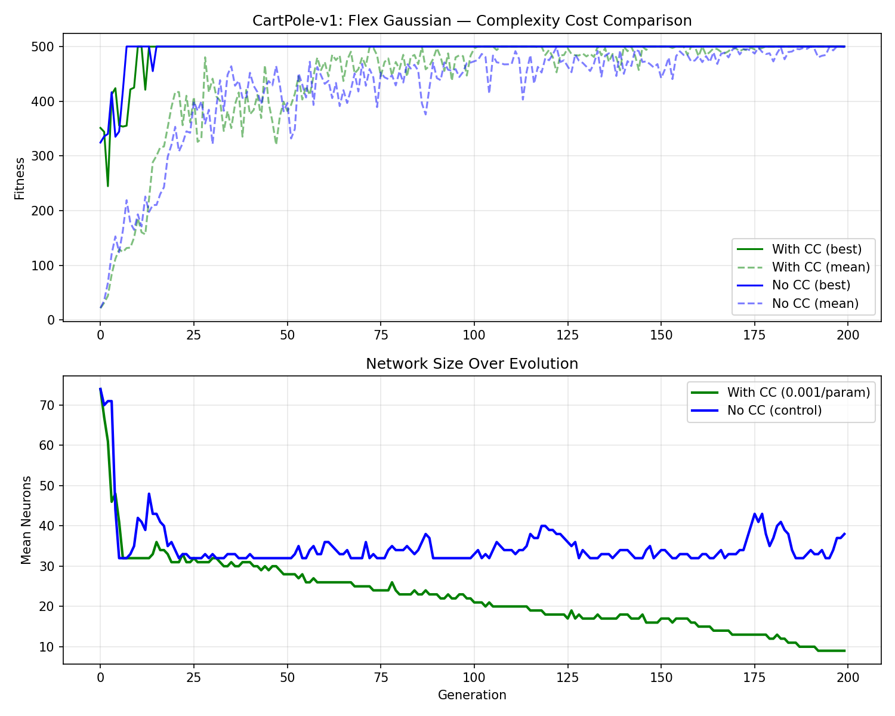
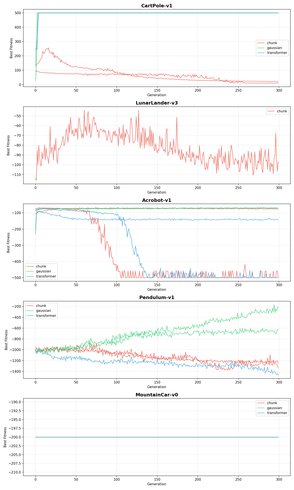
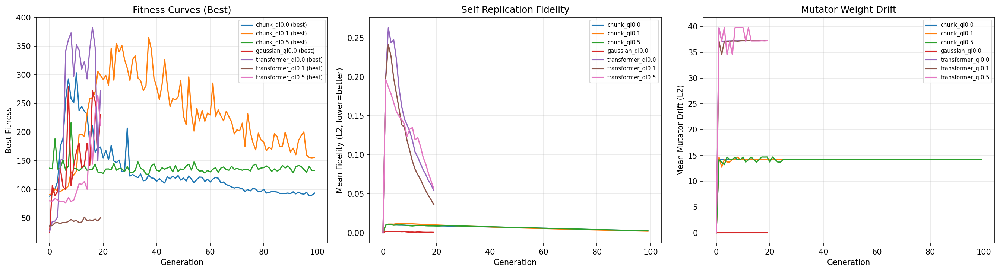
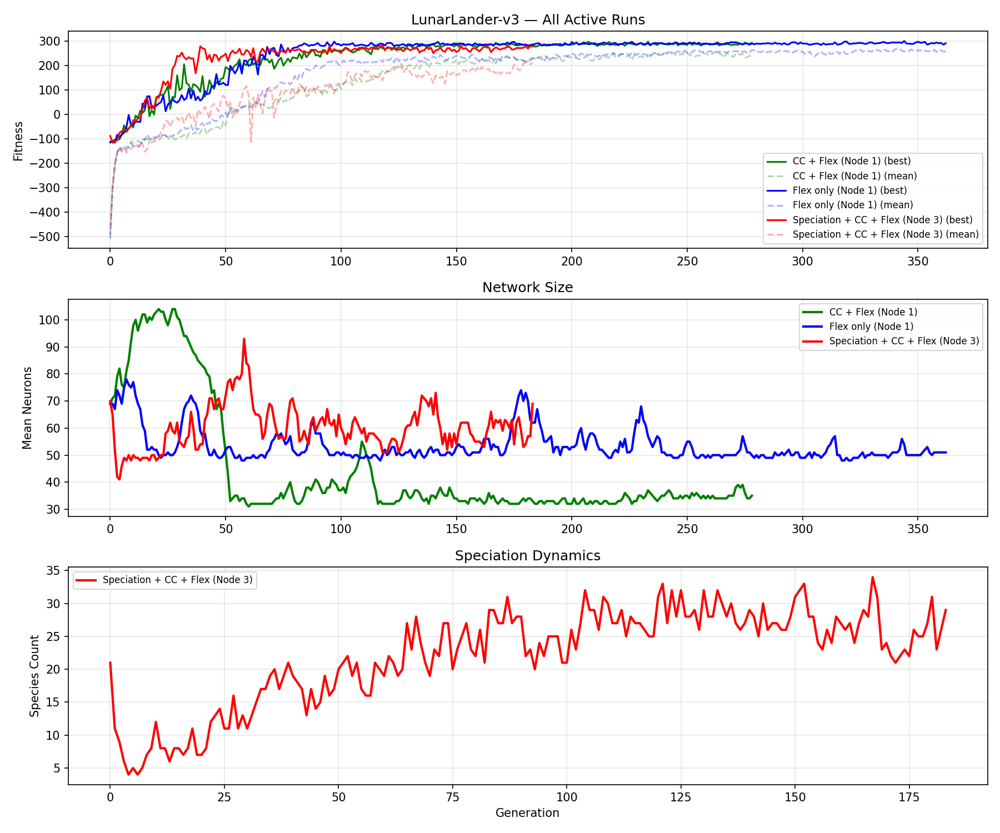

# Neural Mutator — Self-Replicating Neuroevolution

Evolve neural networks that **mutate their own weights**. Each genome contains a **policy** (plays the environment) and a **mutator** (rewrites the entire genome, including itself). Natural selection is the only filter — mutators that destroy themselves die, those that improve themselves thrive.


## Key Results

### Complexity Cost — Networks Learn to Be Smaller

With a per-parameter fitness penalty (`--complexity-cost`), networks evolve to minimal viable size while maintaining full performance.

**CartPole-v1:** 74 → 9 neurons (88% reduction), same 500 fitness.



### Multi-Environment Comparison

Self-replicating Gaussian mutator vs Chunk MLP vs Transformer across 5 environments, 300 generations each.



### Self-Replication — Mutators That Reproduce Themselves

When the mutator must also replicate its own weights (not just the policy), learned mutators outperform Gaussian on CartPole — the opposite of runs without self-replication pressure.



### LunarLander Progress

Active runs comparing flexible architecture with and without complexity cost, plus learned speciation.



## Architecture

```
Genome = [Policy θ_p, Mutator θ_m]

Reproduction (self-replication):
  θ' = Mutator(θ_m)(concat(θ_p, θ_m))
  → θ'_p = θ'[:len(θ_p)]     # new policy
  → θ'_m = θ'[len(θ_p):]     # new mutator weights

Crossover (learned recombination):
  θ_child = Mutator_A(θ_p_A, θ_p_B)
  → Mutator sees BOTH parents and decides how to combine them
```

### Asymmetric Mutation Rates
- Policy weights mutate at **1.0×** rate
- Mutator weights mutate at **0.1×** rate (stability)
- This prevents the mutator from destroying itself while still allowing adaptation

## Features

- **Flexible Architecture** (`--flex`): Networks can add/remove neurons and layers via structural mutations
- **Complexity Cost** (`--complexity-cost`): Per-parameter fitness penalty that evolves smaller networks
- **Parallel Evaluation** (`--workers N`): Multiprocessing pool, ~3.5× speedup with 6 workers
- **Learned Crossover**: Mutator receives both parents' weights and outputs the child
- **Learned Speciation** (`--speciation`): Each genome carries a CompatibilityNet that decides who it can crossover with
- **Genome Save/Load**: Auto-saves `best_genome.pt` each generation for rendering and analysis

## Mutator Architectures

| Mutator | Description | Crossover Mode |
|---------|-------------|----------------|
| **Gaussian** | N(0, σ) noise (ES baseline) | Random per-weight interpolation + noise |
| **Chunk MLP** | Processes weights in fixed-size chunks | Dedicated `cross_net` sees both parents' chunks |
| **Transformer** | Self-attention over weight segments | Cross-attention embedding of both parents |
| **Error Corrector** | Learned reference + targeted corrections | Encodes parent midpoint, corrects toward reference |

## Environments

| Environment | Best Result | Architecture |
|-------------|-----------|--------------|
| CartPole-v1 | **500** (solved) | 9 neurons, 1 layer (with CC) |
| LunarLander-v3 | **~290** | 34 neurons, 1 layer (with CC) |
| Acrobot-v1 | **-70.7** | 64 hidden |
| Pendulum-v1 | **-201.5** | 64 hidden |
| MountainCar-v0 | **-104** | 64 hidden |

## Usage

```bash
# Setup
python -m venv .venv
source .venv/bin/activate
pip install torch gymnasium matplotlib numpy

# Basic run
python -m src.train --env CartPole-v1 --mutator gaussian --generations 100

# Full featured run
python -m src.train \
    --env LunarLander-v3 \
    --mutator gaussian \
    --flex \
    --complexity-cost 0.0001 \
    --workers 6 \
    --pop-size 60 \
    --generations 300 \
    --episodes 10 \
    --output results/my_run

# With speciation
python -m src.train \
    --env LunarLander-v3 \
    --mutator gaussian \
    --flex \
    --speciation \
    --compat-threshold 0.5 \
    --generations 300

# Render gameplay from saved genome
python render_best.py results/my_run/best_genome.pt /tmp/gameplay.gif LunarLander-v3
```

## Key Properties

- **Self-referential**: The mutator modifies itself through its own output
- **Evolvable variation operator**: Natural selection acts on the mutation strategy, not just the policy
- **Learned recombination**: Crossover is performed by the mutator network, not fixed rules
- **Parsimony pressure**: Complexity cost drives evolution toward minimal sufficient architectures

## Related Work

- Neural Network Quine (Chang & Lipson, 2018) — self-replicating networks
- HyperNEAT (Stanley et al., 2009) — CPPNs for indirect weight encoding
- Adaptive RL through Evolving Self-Modifying NNs (Schmidgall, 2020)
- Self-Referential Meta Learning (Kirsch & Schmidhuber, 2022)

## License

MIT
