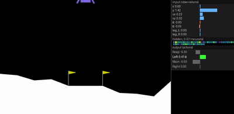
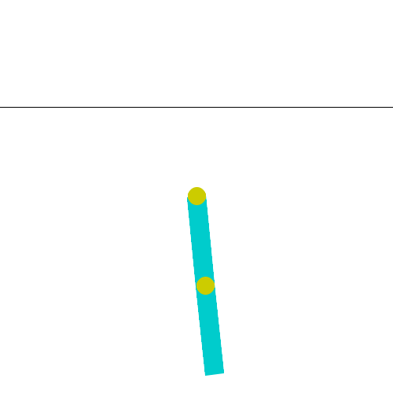
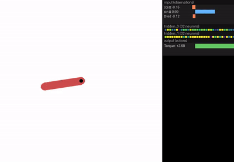

# Neural Mutator — Self-Replicating Neuroevolution

Evolve neural networks that **mutate their own weights**. Each genome contains a **policy** (plays the environment), a **mutator** (rewrites the entire genome, including itself), and a **compatibility network** (decides who can crossover). Natural selection is the only filter — mutators that destroy themselves die, those that improve themselves thrive.

## Architecture


The system has five key components:

- **(a) Genome** — Three co-evolved networks: policy θ_p, mutator θ_m, and compatibility θ_c
- **(b) DualMixture Reproduction** — 80% learned corrections via encoder→corrector pipeline, 20% Gaussian escape hatch (ratio evolved independently across environments, converges to ~20% universally)
- **(c) Evolutionary Loop** — Evaluate → select → speciate → reproduce → structural mutation
- **(d) Learned Speciation** — Compatibility network scores pairwise genome similarity to form breeding groups
- **(e) Learned Crossover** — Mutator network sees both parents and decides how to combine them

The mutator is **self-referential**: since θ_m ⊂ θ, the mutator rewrites its own weights through its own output.

## Results

All runs use the DualMixture mutator with flexible architecture and learned speciation.

### CartPole-v1

**Solved in 2 generations.** Best: 500 (maximum). Mean converges to ~484 by gen 50.

| | |
|---|---|
|  |  |

- **Pop:** 80 · **Gens:** 50 · **Episodes:** 5 · **Seed:** 45
- **Final architecture:** 4→64→2 (Tanh), 386 params
- **Mutator:** 8,374 params (21.7× larger than the policy it evolves)

### LunarLander-v3

**Best: 291.06** — well above the 200 solve threshold. Fleet-trained across 4 nodes (24 parallel workers).

| | |
|---|---|
|  |  |

- **Pop:** 160 · **Gens:** 300 · **Episodes:** 10 · **Seed:** 45 · **Fleet:** 4 nodes × 6 workers
- **Final architecture:** 8→51→4 (Tanh), 667 params
- **Weight analysis:** Angular velocity and angle dominate input importance — the network learned that orientation control is key for landing

### Acrobot-v1

**Best: -64.0** (previous baseline: -70.7). Swing-up solved efficiently.

| | |
|---|---|
|  |  |

- **Pop:** 80 · **Gens:** 300 · **Episodes:** 10 · **Seed:** 45
- **Final architecture:** 6→64→64→3 (Tanh), 2 layers, 112 neurons
- **Fidelity:** Climbed to 0.038 — mutator learned stable self-replication

### Pendulum-v1

**Best: -112.3** with discrete action mapping (continuous control is inherently harder for neuroevolution). Architecture self-simplified from 128→48 neurons over 1000 generations.

| | |
|---|---|
|  |  |

- **Pop:** 80 · **Gens:** 1000 · **Episodes:** 10 · **Seed:** 45
- **Final architecture:** 3→32→32→1 (Tanh), 2 layers — evolved continuous output
- **Fidelity:** 0.00 → 0.23 over 1000 gens — mutator never stopped improving self-replication
- **Best test episode:** -10.01 (near-perfect upright balance)

### Summary

| Environment | Best Reward | Architecture | Gens | Status |
|-------------|-----------|--------------|------|--------|
| CartPole-v1 | **500** | 4→64→2, 1 layer | 50 | ✅ Solved (gen 2) |
| LunarLander-v3 | **291** | 8→51→4, 1 layer | 300 | ✅ Solved |
| Acrobot-v1 | **-64** | 6→64→64→3, 2 layers | 300 | ✅ Beat baseline |
| Pendulum-v1 | **-112** | 3→32→32→1, 2 layers | 1000 | 📈 Improving |

### Cross-Environment Findings

The DualMixture mutator adapts its learned parameters per environment:

- **p_gauss converges to ~20% across all environments** — this ratio appears to be a universal sweet spot
- **Correction scales specialize**: CartPole (0.033) > Pendulum (0.028) > LunarLander (0.020) — harder problems demand finer precision
- **The mutator is 12-22× larger than the policy** — the "how to improve" knowledge is far more complex than the solution itself
- **Flexible architecture works**: networks self-compress to minimal viable size (CartPole: 128→64, Pendulum: 128→48)

## Mutator Architectures

| Mutator | Description | Crossover Mode |
|---------|-------------|----------------|
| **Gaussian** | N(0, σ) noise (ES baseline) | Random per-weight interpolation + noise |
| **Chunk MLP** | Processes weights in fixed-size chunks | Dedicated `cross_net` sees both parents' chunks |
| **Transformer** | Self-attention over weight segments | Cross-attention embedding of both parents |
| **Error Corrector** | Learned reference + targeted corrections | Encodes parent midpoint, corrects toward reference |
| **DualMixture** | NN mutator + Gaussian escape hatch (configurable p) | NN-guided crossover with Gaussian fallback |

## Usage

```bash
# Setup
python -m venv .venv
source .venv/bin/activate
pip install torch gymnasium matplotlib numpy

# Basic run
python -m src.train --env CartPole-v1 --mutator gaussian --generations 100

# Full featured run with DualMixture
python -m src.train \
    --env LunarLander-v3 \
    --mutator dualmixture \
    --flex --speciation \
    --pop-size 80 \
    --generations 300 \
    --episodes 10 \
    --workers 6

# Fleet training (distributed across nodes)
python -m src.train \
    --env LunarLander-v3 \
    --mutator dualmixture \
    --flex --speciation \
    --pop-size 160 --generations 300 --episodes 10 \
    --fleet --fleet-port 5611 --fleet-workers 4
# Then on each worker node:
python -m fleet.worker --host <manager-ip> --port 5611 --workers 6 --name node1
```

## Key Properties

- **Self-referential**: The mutator modifies itself through its own output
- **Evolvable variation operator**: Natural selection acts on the mutation strategy, not just the policy
- **Learned recombination**: Crossover is performed by the mutator network, not fixed rules
- **Adaptive precision**: Correction scales evolve per-environment — tight for hard, loose for easy
- **Parsimony pressure**: Flex architecture + selection drives evolution toward minimal networks

## Related Work

- Neural Network Quine (Chang & Lipson, 2018) — self-replicating networks
- HyperNEAT (Stanley et al., 2009) — CPPNs for indirect weight encoding
- Adaptive RL through Evolving Self-Modifying NNs (Schmidgall, 2020)
- Self-Referential Meta Learning (Kirsch & Schmidhuber, 2022)

## License

MIT
