# Neural Mutator — Self-Replicating Neuroevolution

Evolve neural networks that **mutate their own weights**. Each genome contains a **policy** (plays the environment), a **mutator** (rewrites the entire genome, including itself), and a **compatibility network** (decides who can crossover). Natural selection is the only filter — mutators that destroy themselves die, those that improve themselves thrive.

## Architecture

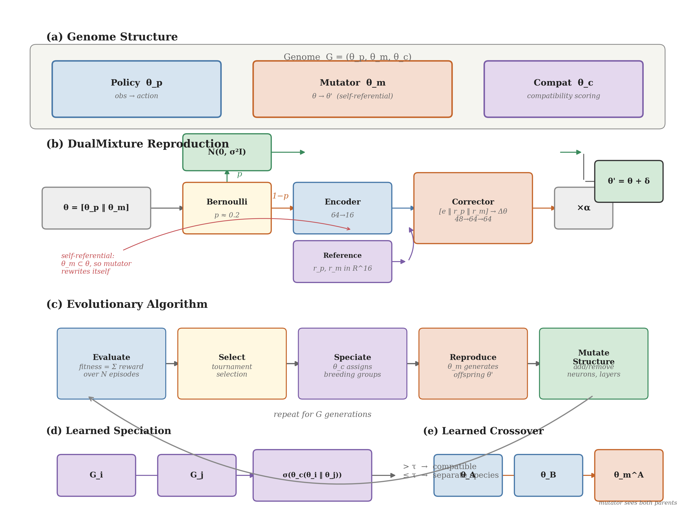

The system has five key components:

- **(a) Genome** — Three co-evolved networks: policy θ_p, mutator θ_m, and compatibility θ_c
- **(b) DualMixture Reproduction** — 80% learned corrections via encoder→corrector pipeline, 20% Gaussian escape hatch (ratio evolved independently across environments, converges to ~20% universally)
- **(c) Evolutionary Loop** — Evaluate → select → speciate → reproduce → structural mutation
- **(d) Learned Speciation** — Compatibility network scores pairwise genome similarity to form breeding groups
- **(e) Learned Crossover** — Mutator network sees both parents and decides how to combine them

The mutator is **self-referential**: since θ_m ⊂ θ, the mutator rewrites its own weights through its own output.

## Results

All runs use the DualMixture mutator with flexible architecture and learned speciation.

### CartPole-v1

**Solved in 2 generations.** Best: 500 (maximum). Mean converges to ~484 by gen 50.

| Training | Gameplay (with activations) |
|---|---|
| 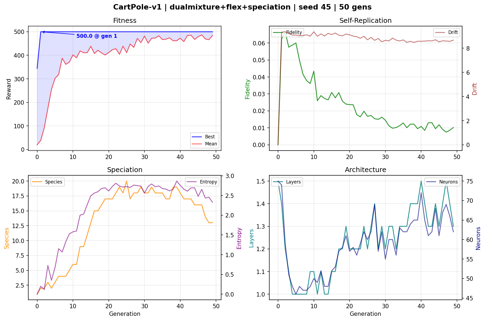 | <video src="results/cartpole_dm_flex_s45_50g/best_gameplay.mp4" width="400"></video> |

- **Pop:** 80 · **Gens:** 50 · **Episodes:** 5 · **Seed:** 45
- **Final architecture:** 4→64→2 (Tanh), 386 params
- **Mutator:** 8,374 params (21.7× larger than the policy it evolves)

### LunarLander-v3

**Best: 291.06** — well above the 200 solve threshold. Fleet-trained across 4 nodes (24 parallel workers).

| Training | Gameplay (with activations) |
|---|---|
| 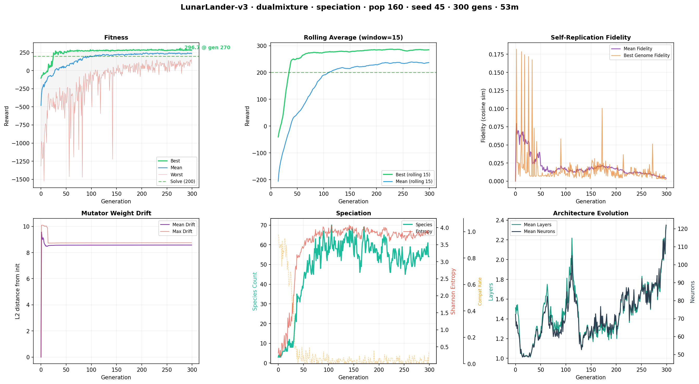 | <video src="results/lunar_s45_300g_fleet/best_gameplay.mp4" width="400"></video> |

- **Pop:** 160 · **Gens:** 300 · **Episodes:** 10 · **Seed:** 45 · **Fleet:** 4 nodes × 6 workers
- **Final architecture:** 8→51→4 (Tanh), 667 params
- **Weight analysis:** Angular velocity and angle dominate input importance — the network learned that orientation control is key for landing

### Acrobot-v1

**Best: -64.0** (previous baseline: -70.7). Swing-up solved efficiently.

| Training | Gameplay (with activations) |
|---|---|
| 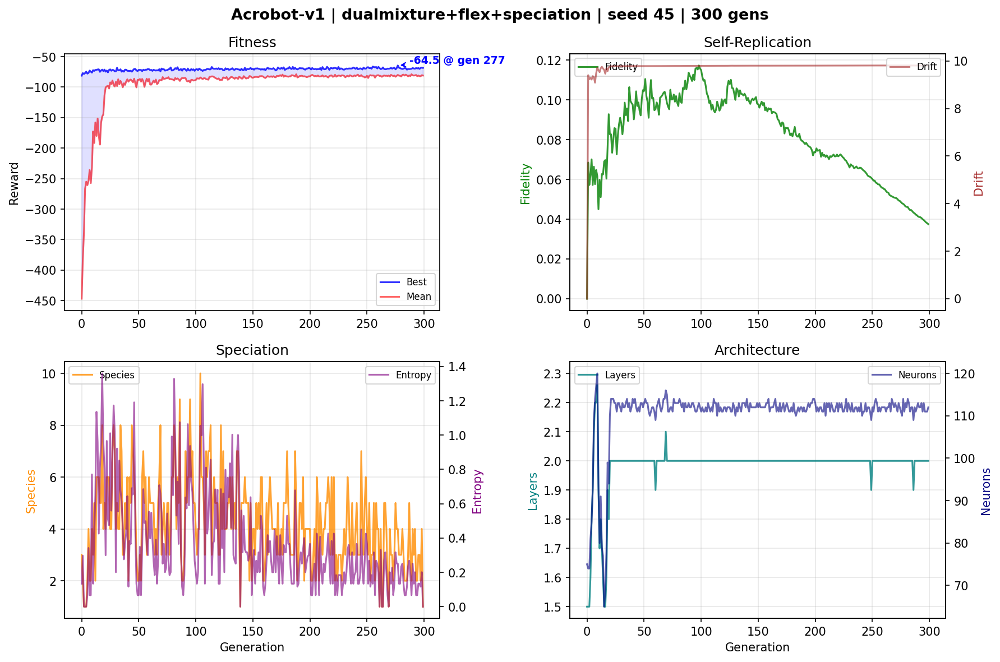 | <video src="results/acrobot_dm_flex_s45_300g/best_gameplay.mp4" width="400"></video> |

- **Pop:** 80 · **Gens:** 300 · **Episodes:** 10 · **Seed:** 45
- **Final architecture:** 6→64→64→3 (Tanh), 2 layers, 112 neurons
- **Fidelity:** Climbed to 0.038 — mutator learned stable self-replication

### Pendulum-v1

**Best: -112.3** with discrete action mapping (continuous control is inherently harder for neuroevolution). Architecture self-simplified from 128→48 neurons over 1000 generations.

| Training | Gameplay (with activations) |
|---|---|
| 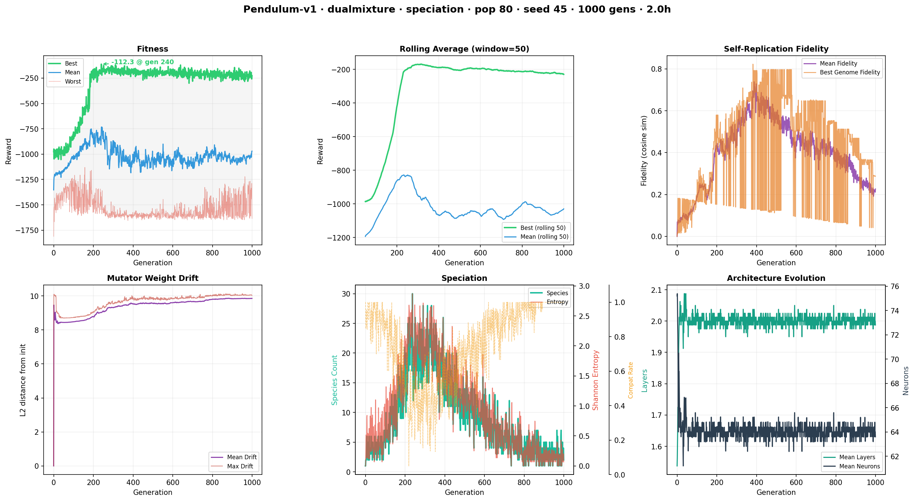 | <video src="results/pendulum_dm_flex_s45_1000g/best_gameplay.mp4" width="400"></video> |

- **Pop:** 80 · **Gens:** 1000 · **Episodes:** 10 · **Seed:** 45
- **Final architecture:** 3→32→32→1 (Tanh), 2 layers — evolved continuous output
- **Fidelity:** 0.00 → 0.23 over 1000 gens — mutator never stopped improving self-replication
- **Best test episode:** -10.01 (near-perfect upright balance)

### CarRacing-v3

**Best: 898.3** (3-episode average) — near the theoretical ceiling (~920-940). CNN policy processes raw 96×96 pixels. Fleet-trained with learned speciation and compatibility network.

| Training | Gameplay (with activations) |
|---|---|
| 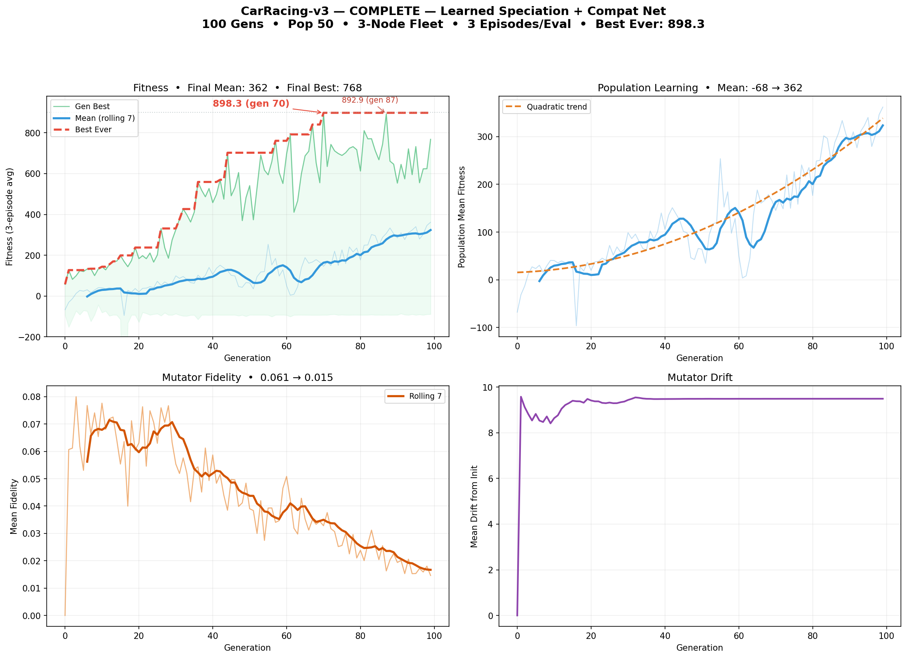 | <video src="results/carracing_compat_s45_100g/best_gameplay.mp4" width="400"></video> |

- **Pop:** 50 · **Gens:** 100 · **Episodes:** 3 · **Seed:** 45 · **Fleet:** 3 nodes (21 workers)
- **Architecture:** CNN-Large — 4 conv layers (3→8→16→16→8) + FC (288→32→3), 17,971 params
- **Mutator:** 8,374 params · **Compat net:** 3,153 params · **Total genome:** 29,498 params
- **Training time:** ~7 hours
- **Eval (seed 42):** 836.4 reward
- **Population mean:** -68 → 362 over 100 gens — the entire population learned to drive, not just elites
- **Note:** Random track layouts each episode force genuine generalization — no memorization possible

Previous run without compat net: 808.9 (pop 30, 100 gens). The learned speciation run improved by **11%** with a larger population and compatibility-gated crossover.

### Summary

| Environment | Best Reward | Architecture | Gens | Status |
|-------------|-----------|--------------|------|--------|
| CartPole-v1 | **500** | 4→64→2, 1 layer | 50 | ✅ Solved (gen 2) |
| LunarLander-v3 | **291** | 8→51→4, 1 layer | 300 | ✅ Solved |
| Acrobot-v1 | **-64** | 6→64→64→3, 2 layers | 300 | ✅ Beat baseline |
| Pendulum-v1 | **-112** | 3→32→32→1, 2 layers | 1000 | 📈 Improving |
| CarRacing-v3 | **898** | CNN 4conv+FC, 17,971 params | 100 | 🏎️ Near-ceiling |

### Cross-Environment Findings

The DualMixture mutator adapts its learned parameters per environment:

- **p_gauss converges to ~20% across all environments** — this ratio appears to be a universal sweet spot
- **Correction scales specialize**: CartPole (0.033) > Pendulum (0.028) > LunarLander (0.020) — harder problems demand finer precision
- **Mutator-to-policy ratio varies dramatically**: 21.7× for CartPole (386-param policy) down to 0.47× for CarRacing (17,971-param policy) — larger policies contain enough structure that the mutator doesn't need to be bigger
- **Flexible architecture works**: networks self-compress to minimal viable size (CartPole: 128→64, Pendulum: 128→48)

## Mutator Analysis

Visualizing what the mutator networks actually learn across environments.

### Weight Distributions

The mutator's learned weights reveal how each environment shapes the mutation strategy:

| | |
|---|---|
| 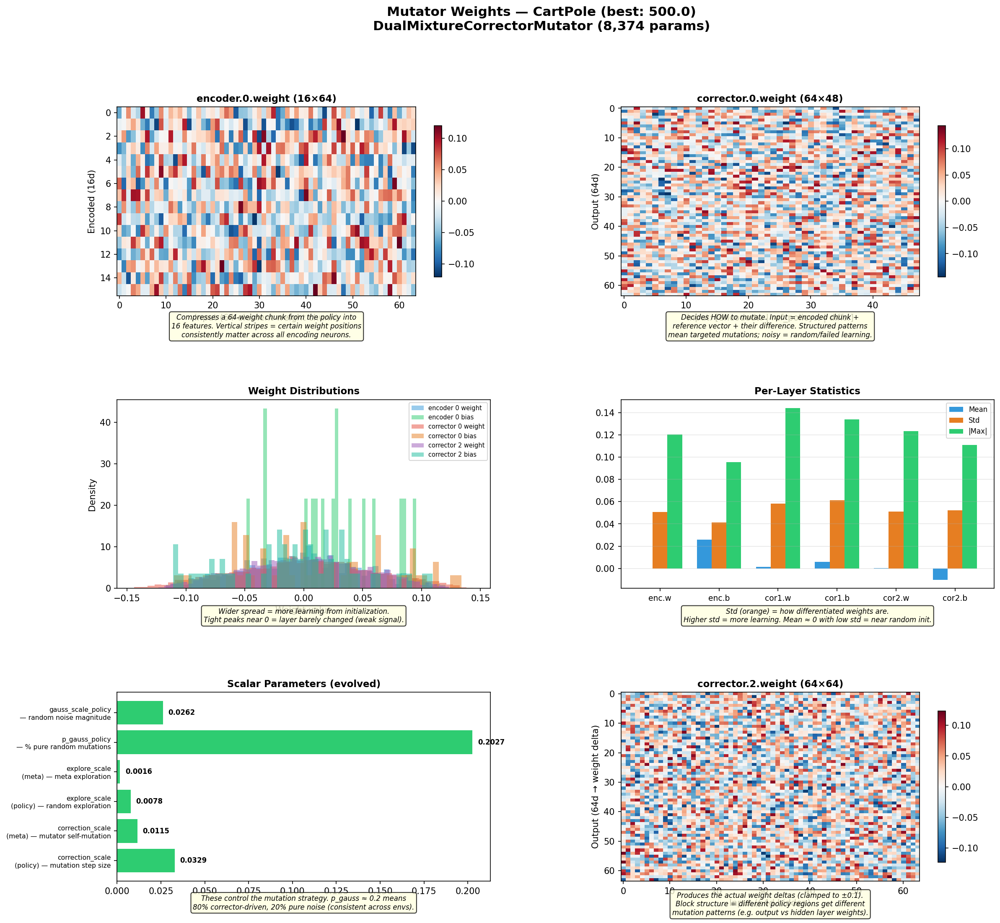 | 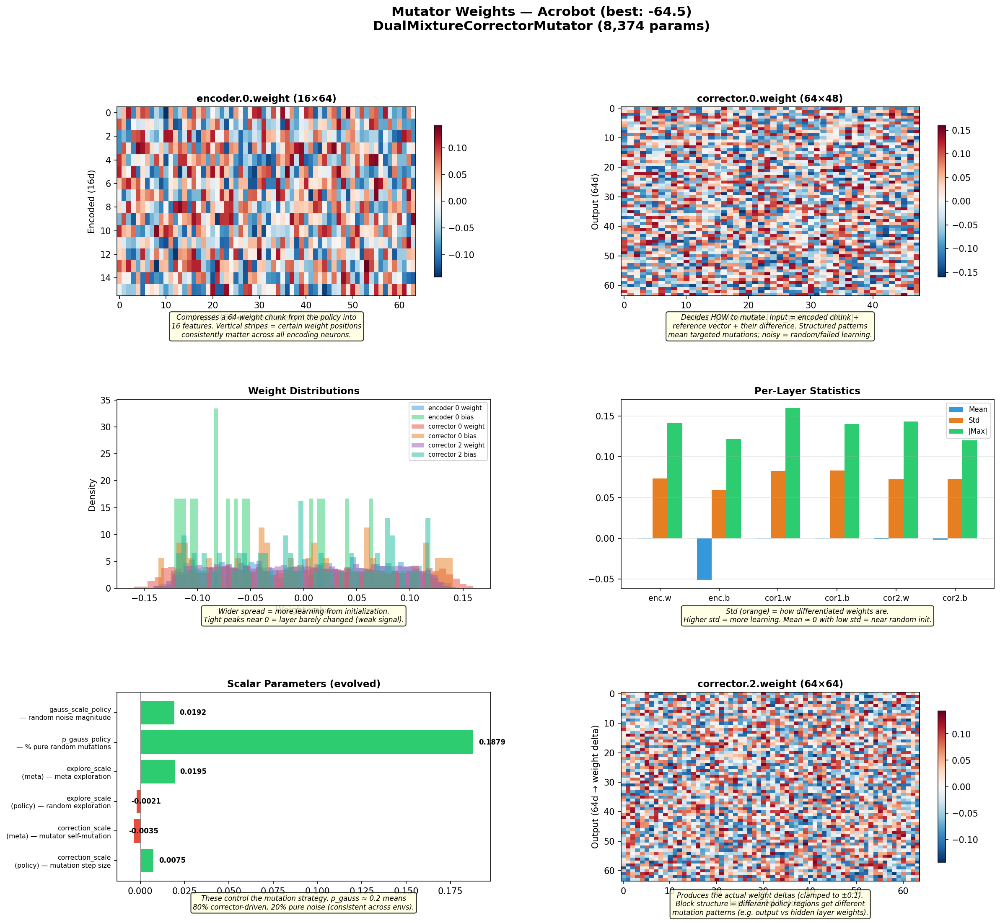 |
| 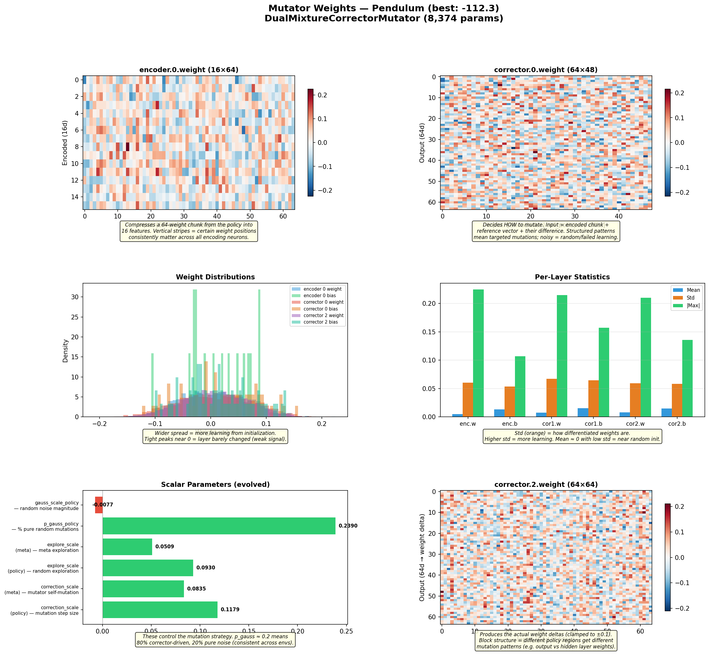 | 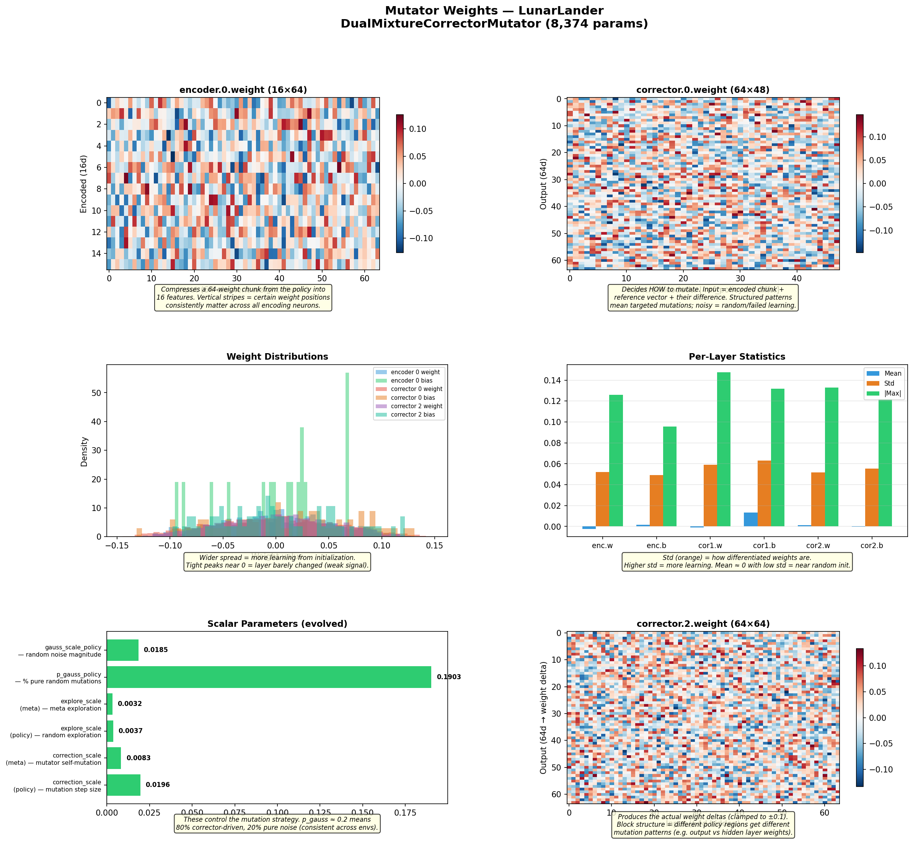 |
| 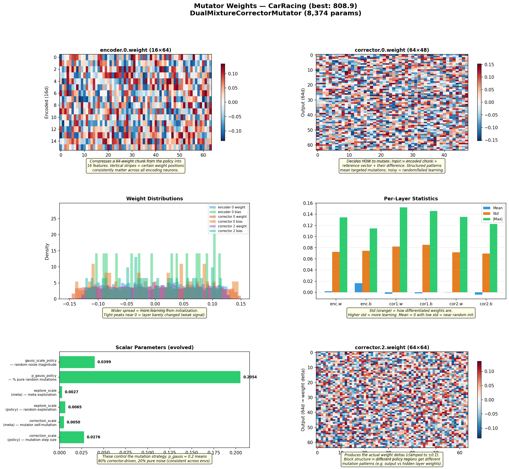 | |

### Mutation Deltas Across Environments

Running each environment's best mutator on its own best genome 10 times reveals what the mutator actually changes:

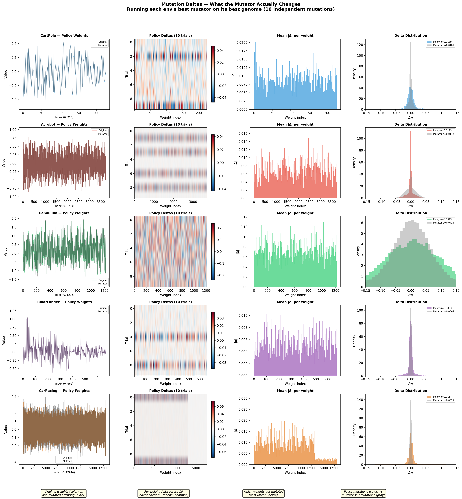

**Reading the delta heatmaps (column 2):** The vertical bands correspond to **layer boundaries** in the policy network. The mutator processes weights in 64-element chunks, and each layer's weights have different magnitudes and roles — so the corrector learns to produce different-sized deltas per region.

**Per-environment weight maps:**

| Environment | Policy Params | Weight Index Layout |
|---|---|---|
| **CartPole** | 226 | `[0-127]` input→hidden weight · `[128-159]` bias · `[160-225]` hidden→output |
| **Acrobot** | 3,715 | `[0-447]` layer 1 · `[448-3567]` layer 2 (3,072 weights — dominant band) · `[3568-3714]` output |
| **Pendulum** | 1,217 | `[0-127]` layer 1 · `[128-1183]` layer 2 (1,024 weights) · `[1184-1216]` output |
| **LunarLander** | 667 | `[0-458]` input→hidden (408 weights + 51 bias) · `[459-666]` hidden→output |
| **CarRacing** | 17,971 | `[0-391]` conv1 · `[392-2455]` conv2 · `[2456-6567]` conv3+4 · `[6568-8623]` conv6 · `[8624-17871]` **FC (9,216 params — barely mutated)** |

**Key findings:**
- **Bias boundaries** create visible band edges — biases get mutated differently than weights
- **64-element chunk boundaries** create subtle periodic shifts in mutation magnitude
- **CarRacing** is the most dramatic: the mutator learned to focus on conv layers and leave the large FC layer (9,216 params) nearly untouched — the feature extractors matter more than the action mapper
- **Acrobot** shows near-zero deltas everywhere — the corrector failed to learn useful mutations, falling back on the 20% Gaussian noise for all progress

### Learned Mutator vs Random Noise

A key question: does the mutator learn structured mutations, or is it just fancy Gaussian noise? We ran each environment's best mutator 20 times on its own best genome and compared the resulting weight deltas to matched random Gaussian noise.

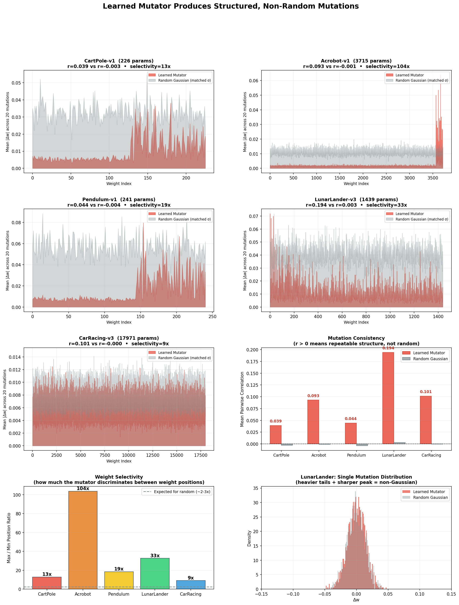

| Environment | Mutator Correlation | Random Correlation | Selectivity | Sparsity |
|---|---|---|---|---|
| CartPole | 0.039 | -0.003 | 13× | 14.9% |
| Acrobot | **0.093** | -0.001 | **104×** | **52.6%** |
| Pendulum | 0.044 | -0.004 | 19× | 10.5% |
| LunarLander | **0.194** | 0.003 | 33× | 18.5% |
| CarRacing | 0.101 | -0.000 | 9× | 16.4% |

**Key findings:**
- **Inter-mutation correlation** is consistently positive (0.04–0.19) vs ~0 for random noise — the mutator targets the same weight positions repeatedly
- **Selectivity** (max/min mutation magnitude ratio) ranges from 9× to 104× — random would be ~2-3×. The mutator learned which weights matter
- **Acrobot** is most dramatic: 52.6% of weights are left virtually untouched, with 104× selectivity — the mutator learned extreme surgical precision
- **Distribution shape** shows heavier tails + sharper peak than Gaussian — precise small changes plus occasional large targeted jumps

The high mutator drift (~9.5) means the mutator weights themselves evolved far from initialization — but what the mutator *produces* is clearly structured, not random.

## Mutator Architecture

The **DualMixtureCorrectorMutator** (8,374 params) is the sole mutator architecture. It processes policy weights in 64-element chunks through a learned encoder→corrector pipeline:

1. **Encoder** (64→16): Compresses each weight chunk to a latent representation
2. **Corrector** (48→64→64): Compares encoded chunk against a learned reference vector, outputs targeted weight deltas (clamped to ±0.1)
3. **Gaussian escape** (~20%): With evolved probability, adds pure Gaussian noise to prevent fixed-point collapse
4. **Dual-head**: Separate scales for policy weights (larger mutations) vs mutator self-weights (conservative)

## Usage

```bash
# Setup
python -m venv .venv
source .venv/bin/activate
pip install torch gymnasium matplotlib numpy

# Basic run
python -m src.train --env CartPole-v1 --generations 100

# Full featured run
python -m src.train \
    --env LunarLander-v3 \
    --mutator dualmixture \
    --flex --speciation \
    --pop-size 80 \
    --generations 300 \
    --episodes 10 \
    --workers 6

# Fleet training (distributed across nodes)
python -m src.train \
    --env LunarLander-v3 \
    --mutator dualmixture \
    --flex --speciation \
    --pop-size 160 --generations 300 --episodes 10 \
    --fleet --fleet-port 5611 --fleet-workers 4
# Then on each worker node:
python -m fleet.worker --host <manager-ip> --port 5611 --workers 6 --name node1
```

## Key Properties

- **Self-referential**: The mutator modifies itself through its own output
- **Evolvable variation operator**: Natural selection acts on the mutation strategy, not just the policy
- **Learned recombination**: Crossover is performed by the mutator network, not fixed rules
- **Adaptive precision**: Correction scales evolve per-environment — tight for hard, loose for easy
- **Parsimony pressure**: Flex architecture + selection drives evolution toward minimal networks

## Related Work

- Neural Network Quine (Chang & Lipson, 2018) — self-replicating networks
- HyperNEAT (Stanley et al., 2009) — CPPNs for indirect weight encoding
- Adaptive RL through Evolving Self-Modifying NNs (Schmidgall, 2020)
- Self-Referential Meta Learning (Kirsch & Schmidhuber, 2022)

## License

MIT
